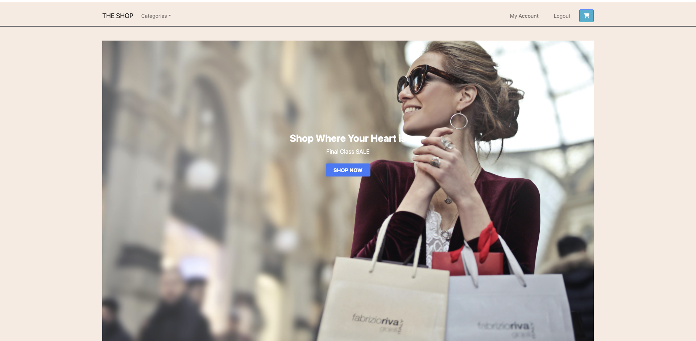
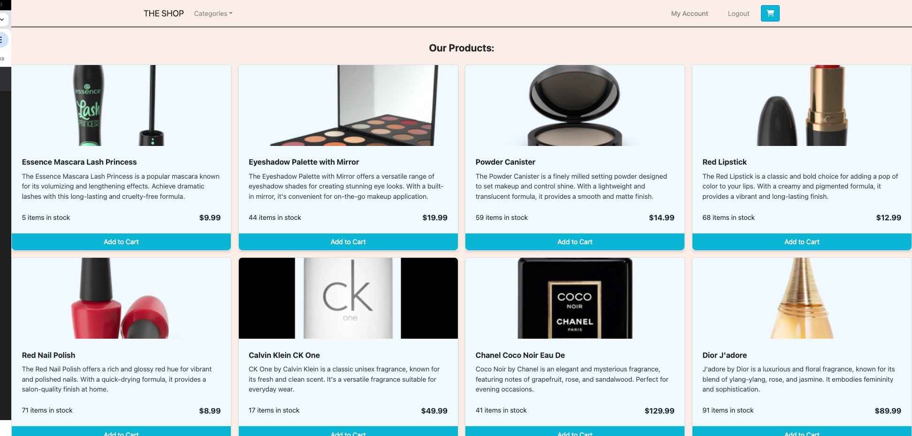
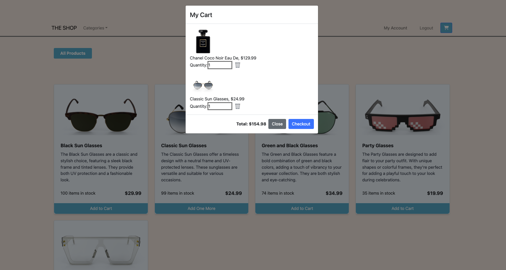
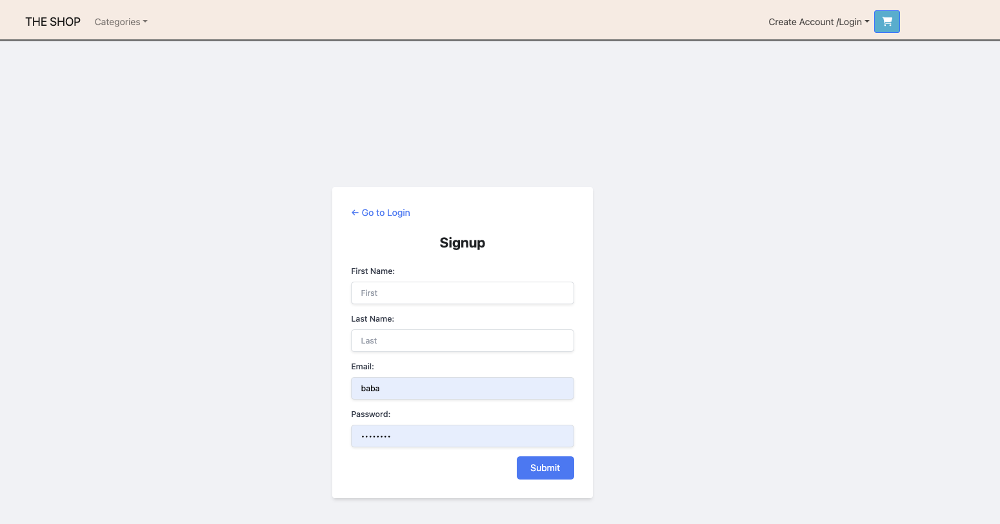
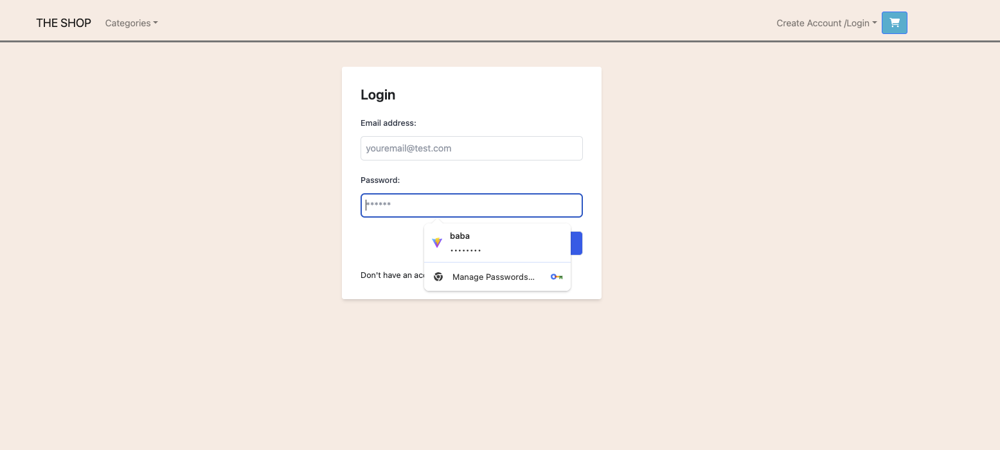
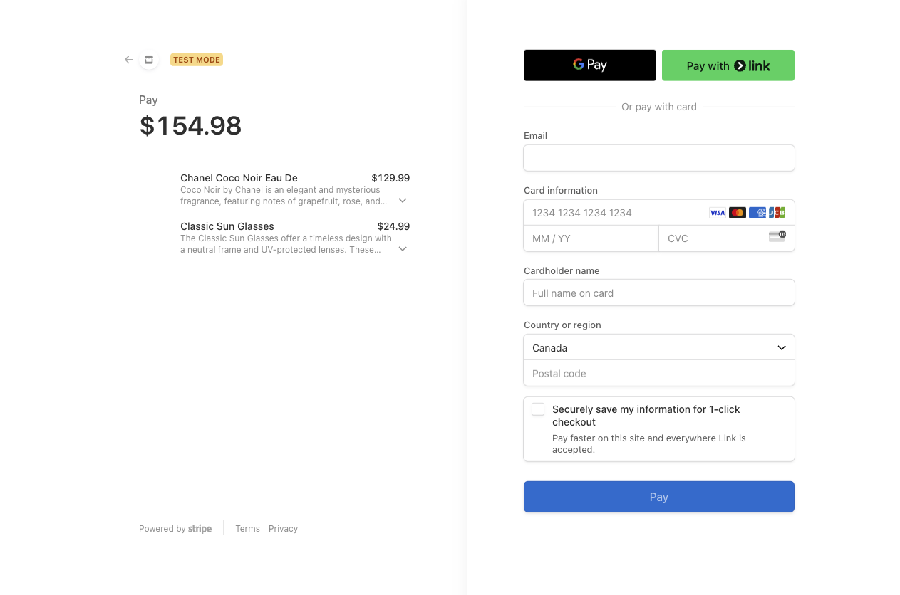
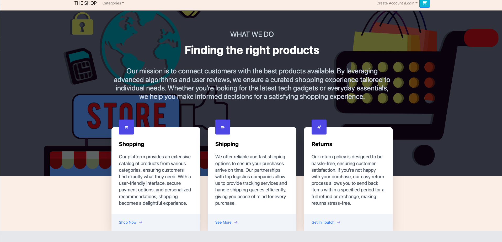
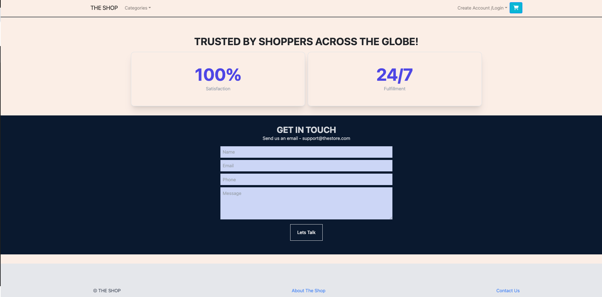

# The SHOP

## Description
The SHOP is a full-stack e-commerce application web application that provides a platform for users to browse products, add items to their cart, and make purchases. It features a robust backend with a MongoDB Atlas database and a React frontend, ensuring a seamless shopping experience.

## Links
- [GitHub Repository](https://github.com/J-0987/Project-3)
- [Live Link](https://project-3-v9eb.onrender.com/)

## Table of Contents
- [Features](#features)
- [Technology](#technology)
- [Preview](#preview)
- [Installation](#installation)
- [Usage](#usage)
- [Contributing](#contributing)
- [Tests](#tests)
- [Questions](#questions)
- [License](#license)


## Features
Key features of the application include user authentication, shopping cart functionality, search by product category and secure payment processing. The application is designed with a mobile-first approach, ensuring a convenient shopping experience across all devices.

## Technology
The application leverages **React.js** to deliver a fast, single-page application with real-time updates, ensuring as smooth and responsive user interface. **Context API** is applied to align with best practices, The backend is built with **Node.js and Express.js**, providing scalable infrastructure. Data is stored in a **MongoDB database**, ensuring efficient data retrieval and storage.

This project also relied on the following technologies:

- Stripe for payment processing 
- Tailwind CSS
- Bootstrap React
- Styled Components
- Render
- bcrypt
- Apollo
- jsonwebtoken
- nodemon


## Preview

**Landing Page View**




**Products Page View**






**Create Account and Login Views**






**Payment View**



**About/Contact View**





## Installation
To install the E-Commerce Application, follow these steps:

1. Clone the GitHub repository to your local machine:
    ```sh
    git clone https://github.com/J-0987/Project-3.git
    ```
2. Navigate to the project directory:
    ```sh
    cd Project-3
    ```
3. Install the required dependencies:
    ```sh
    npm install
    ```
4. Set up environment variables:
    - Create a `.env` file in the root directory of the server folder.
    - Add your MongoDB Atlas connection string to the `.env` file:
    ```php
    MONGODB_URI=mongodb+srv://<username>:<password>@cluster0.mongodb.net/<dbname>?retryWrites=true&w=majority
    ```

## Usage
To use the E-Commerce Application:

1. Seed the database with initial data, build the client, and start the server by running:
    ```sh
    npm run seed && npm run build && npm run develop
    ```
2. Open your web browser and navigate to `http://localhost:3000` to access the application.
3. Browse through products, add items to your cart, and proceed to checkout.

## Contributing
Contributions to the E-Commerce Application are welcome! Follow these steps to contribute:

1. Fork the repository.
2. Create a new branch for your feature or enhancement:
    ```sh
    git checkout -b feature-name
    ```
3. Make your changes and commit them, following best practices for commit messages:
    ```sh
    git commit -m "Descriptive commit message"
    ```
4. Push your changes to your forked repository:
    ```sh
    git push origin feature-name
    ```
5. Submit a pull request with a clear description of your changes.

## Tests
The E-Commerce Application does not currently have any automated tests. Contributions to add tests are welcome!

## Questions
For any questions or feedback, please feel free to contact the team.

## License
This project is licensed under the terms of the MIT license.
